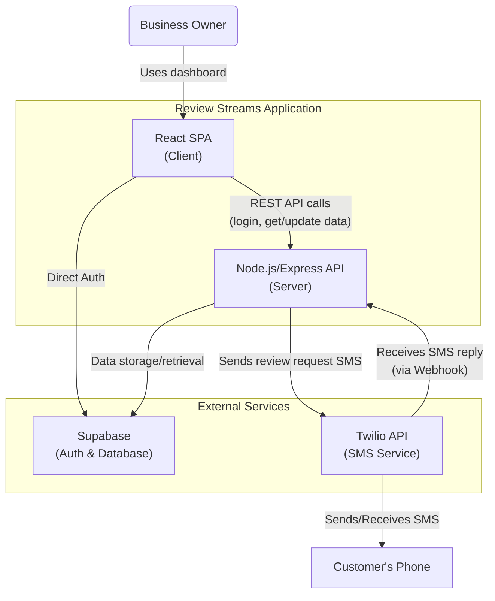

# Review Streams: System Architecture

*A comprehensive overview of the Review Streams application, its components, data flows, and deployment strategy.*

---

## Table of Contents
1.  [Architecture Diagram](#architecture-diagram)
2.  [Core Components](#core-components)
    - [Frontend (Client)](#1-frontend-client)
    - [Backend (API Server)](#2-backend-api-server)
    - [Database (Supabase)](#3-database-supabase)
    - [External Services](#4-external-services)
3.  [Data & API](#data--api)
    - [API Endpoint Structure](#api-endpoint-structure)
    - [Database Schema](#database-schema)
4.  [Key Workflows](#key-workflows)
    - [User Authentication](#user-authentication)
    - [Sending & Receiving Reviews](#sending--receiving-reviews)
5.  [Deployment & Infrastructure](#deployment--infrastructure)

---

## Architecture Diagram

---

## Core Components

The application is composed of a frontend single-page application, a backend API, a database, and several external services.

### 1. Frontend (Client)
> The frontend is a **React-based Single Page Application (SPA)** that provides the user interface for business owners. It allows them to manage contacts, view review dashboards with analytics, and configure their company settings.

*   **Technology Stack**: React, React Router, Supabase.js for auth, Recharts for charts, Axios for HTTP requests, Styled Components.
*   **Key Responsibilities**:
    *   User authentication (Login/Logout).
    *   Dashboard with review statistics and charts.
    *   Contact management (CRUD operations).
    *   Sending manual review requests.
    *   Company profile management.

### 2. Backend (API Server)
> The backend is a **Node.js server using the Express framework**. It exposes a RESTful API for the frontend client, handles the core business logic, and provides a webhook for receiving inbound SMS messages from Twilio.

*   **Technology Stack**: Node.js, Express.js, `supabase-js` for database interaction, Twilio SDK.
*   **Primary File**: `api/server.js` serves as the main entry point and handles routing and webhook logic.

### 3. Database (Supabase)
> **Supabase** is used as the backend-as-a-service provider, offering both a **PostgreSQL database** and **authentication services**. It stores all persistent data for the application.

### 4. External Services
*   **Twilio**: Powers all SMS functionality. The backend communicates with the Twilio API to send review requests, and Twilio calls a webhook on the backend when a customer replies.
*   **Supabase Auth**: Manages user identity, login, and session management.

---

## Data & API

### API Endpoint Structure

The backend exposes a RESTful API. Key routes are organized by resource:

| Method | Endpoint                    | Description                                         |
| :----- | :-------------------------- | :-------------------------------------------------- |
| `GET`    | `/api/companies`            | Get all companies                                   |
| `GET`    | `/api/companies/:id`        | Get a single company by its ID                      |
| `GET`    | `/api/companies/:id/reviews`| Get all reviews for a specific company              |
| `POST`   | `/api/companies/:id/send-review`| Send a review request SMS to a customer         |
| `GET`    | `/api/companies/:id/stats`  | Get review statistics for a company                 |
| `GET`    | `/api/reviews`              | Get all reviews                                     |
| `POST`   | `/api/reviews`              | Create a new review (used by webhook)               |
| `GET`    | `/api/users/profile`        | Get the current user's profile                      |
| `PUT`    | `/api/users/profile`        | Update the current user's profile                   |
| `POST`   | `/api/users/company`        | Create or update the user's company information     |
| `GET`    | `/api/contacts`             | Get all contacts for the user's company             |
| `POST`   | `/api/contacts`             | Create a new contact                                |
| `PATCH`  | `/api/contacts/:id`         | Update an existing contact                          |
| `DELETE` | `/api/contacts/:id`         | Delete a contact                                    |
| `POST`   | `/api/text-webhook`         | **Webhook** for receiving inbound SMS from Twilio   |

### Database Schema

The data is stored in a Supabase (PostgreSQL) database. The schema is inferred from API routes:

| Table Name        | Description                                                                 | Key Columns                                     |
| :---------------- | :-------------------------------------------------------------------------- | :---------------------------------------------- |
| `profiles`        | Stores user authentication and profile information.                         | `id`, `name`, `phone`, `email`                  |
| `companies`       | Stores information about businesses, linked to users.                       | `id`, `name`, `user_id`, `phone`, `website`     |
| `contacts`        | Stores customer contact information for each company.                       | `id`, `company_id`, `phone`, `name`             |
| `review_requests` | Logs each outgoing review request sent to a customer.                       | `id`, `company_id`, `customer_phone`, `responded` |
| `reviews`         | Stores the actual reviews received from customers, including rating and text.| `id`, `company_id`, `phone_from`, `body`, `rating`|

---

## Key Workflows

### User Authentication

> The application uses Supabase for authentication.

1.  A user navigates to the login page.
2.  The client's Supabase UI component handles the login flow.
3.  On success, Supabase returns a JWT access token to the client.
4.  This token is included in the `Authorization` header for all protected API requests.

### Sending & Receiving Reviews

> This flow describes the end-to-end process from sending a request to logging a review.

1.  **Request Sent**: A business owner sends a review request from the client dashboard. This triggers a `POST` to `/api/companies/:id/send-review`.
2.  **Backend Processing**: The backend receives the request, logs it in the `review_requests` table, and uses the Twilio SDK to send the SMS.
3.  **Customer Reply**: The customer replies to the SMS.
4.  **Webhook Triggered**: Twilio receives the reply and sends a `POST` request to the `/api/text-webhook` on the backend.
5.  **Review Logged**: The webhook handler parses the SMS, creates a new entry in the `reviews` table, and marks the original request in `review_requests` as `responded`.
6.  **Dashboard Updated**: The new review data is now available to be displayed on the business owner's dashboard.

---

## Deployment & Infrastructure

*   **Frontend**: The React application is a static build, suitable for hosting on services like **Vercel** or **Netlify**. The `proxy` in `package.json` is for local development convenience.
*   **Backend**: The API server is designed to be deployed as **serverless functions**, likely on **Vercel**, as indicated by the `!process.env.VERCEL` check in `api/server.js`.

*   **Backend**: The `api/server.js`